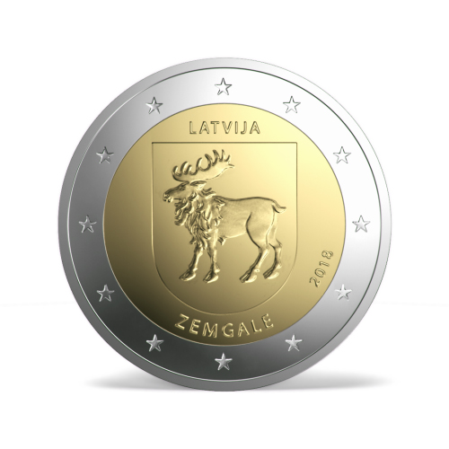
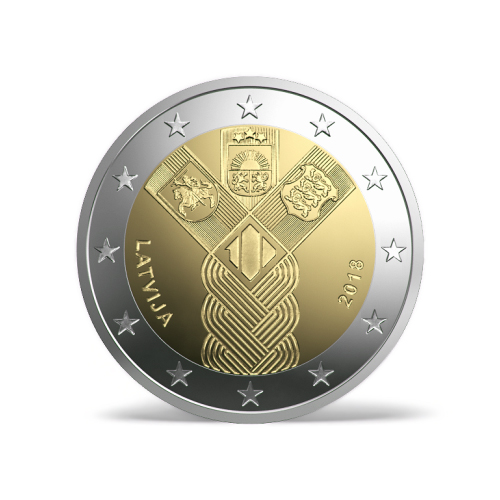
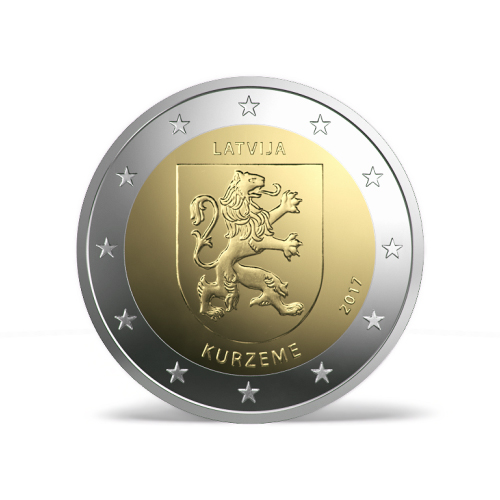
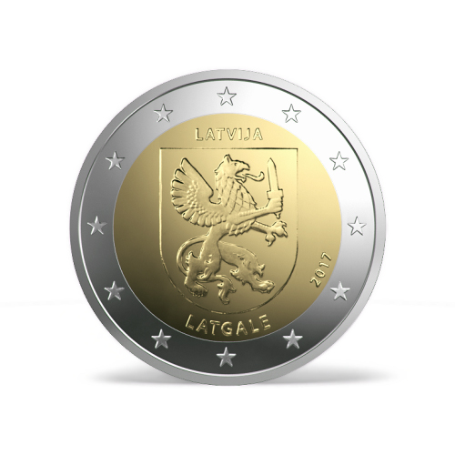
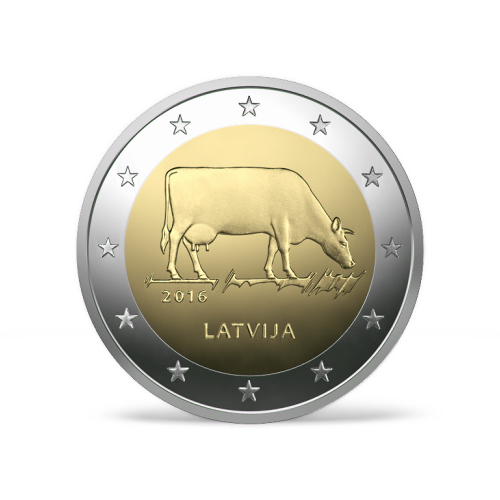
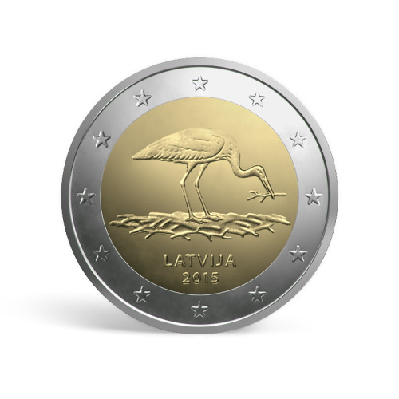
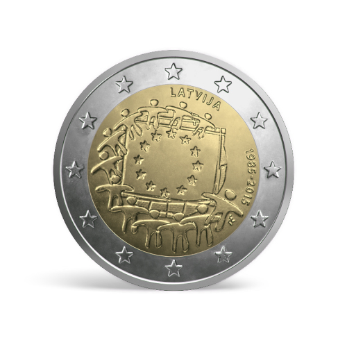
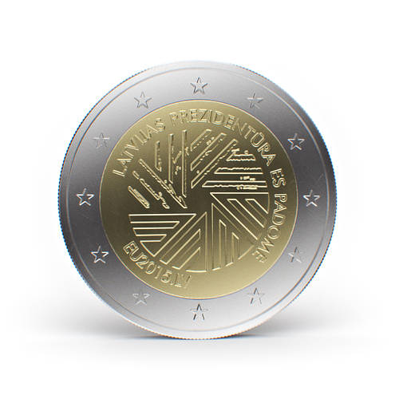
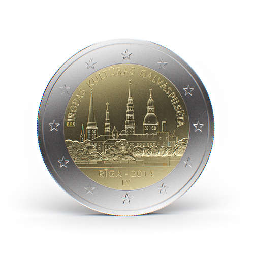

# Latvia
[Circulation](#circulation) 
[2 Euro CC](#2eurocc) 

## Circulation
 

## 2 Euro CC
 

#### Zemgale (2018)
Date of Issue: **2018** 
Mintage: **500,000** 
Mint: **Staatliche Münzen Baden-Württemberg (Germany)**

 

#### Centenary of the Baltic States (2018)
Date of Issue: **2018** 
Mintage: **512,000** 
Mint: **UAB Lietuvos monetų kalykla (Lithuania)**

 

#### Kurzeme (2017)
Date of Issue: **2017** 
Mintage: **530,000** 
Mint: **Staatliche Münzen Baden-Württemberg (Germany)**

 

#### Latgale (2017)
Date of Issue: **2017** 
Mintage: **530,000** 
Mint: **Staatliche Münzen Baden-Württemberg (Germany)**

 

#### Vidzeme (2016)
Date of Issue: **2016** 
Mintage: unknown 
Mint: **UAB Lietuvos monetų kalykla (Lithuania)**

 

#### The Latvian Brown (2016)
Date of Issue: **2016** 
Mintage: **1,010,000** 
Mint: **UAB Lietuvos monetų kalykla (Lithuania)**

 

#### Stork (2015)
Date of Issue: **2015** 
Mintage: **1,000,000** 
Mint: **UAB Lietuvos monetų kalykla (Lithuania)**

 

#### 30 Years of the EU Flag (2015)
Date of Issue: **2015** 
Mintage: unknown 
Mint: **Staatliche Münzen Baden-Württemberg (Germany)**

 

#### Latvian Presidency of the Council of the EU (2015)
Date of Issue: **2015** 
Mintage: **1,000,000** 
Mint: **Staatliche Münzen Baden-Württemberg (Germany)**

 

#### Riga - European Capital of Culture 2014 (2014)
Date of Issue: **2014** 
Mintage: **700,000** 
Mint: **Staatliche Münzen Baden-Württemberg (Germany)**
