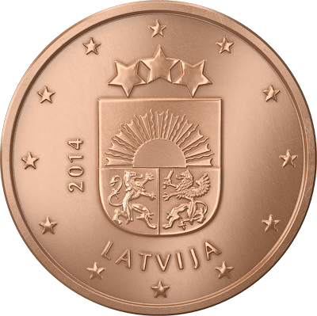
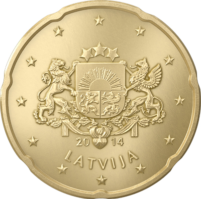
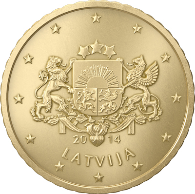

# Latvia

## Circulation
 

## 2 Euro CC
 

#### Zemgale (2018)
Date of Issue: **2018** 
Mintage: **500,000** 
Mint: **Staatliche Münzen Baden-Württemberg (Germany)**

 

#### Centenary of the Baltic States (2018)
Date of Issue: **2018** 
Mintage: **512,000** 
Mint: **UAB Lietuvos monetų kalykla (Lithuania)**

