# Lithuania

## Circulation
 

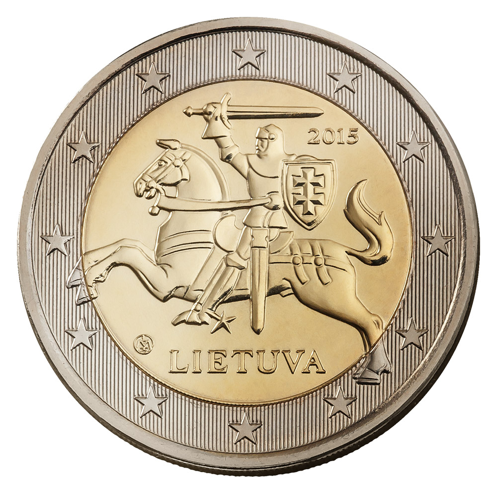
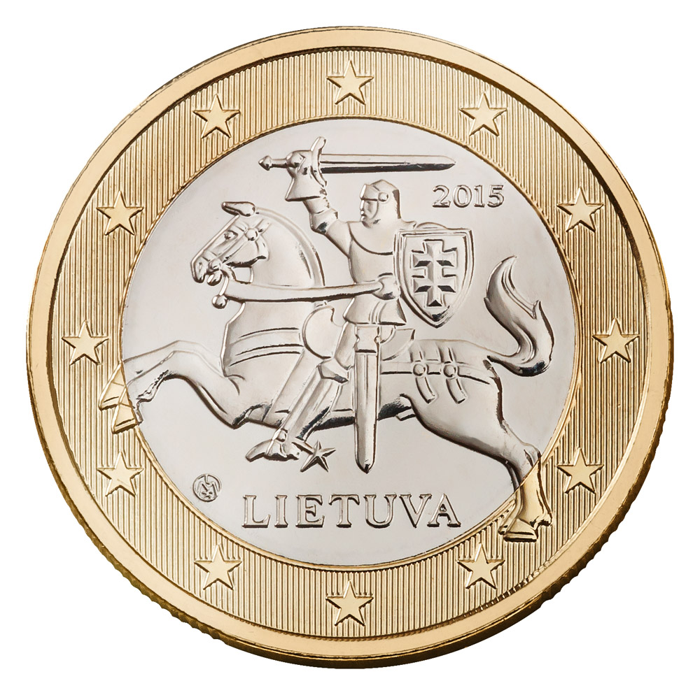
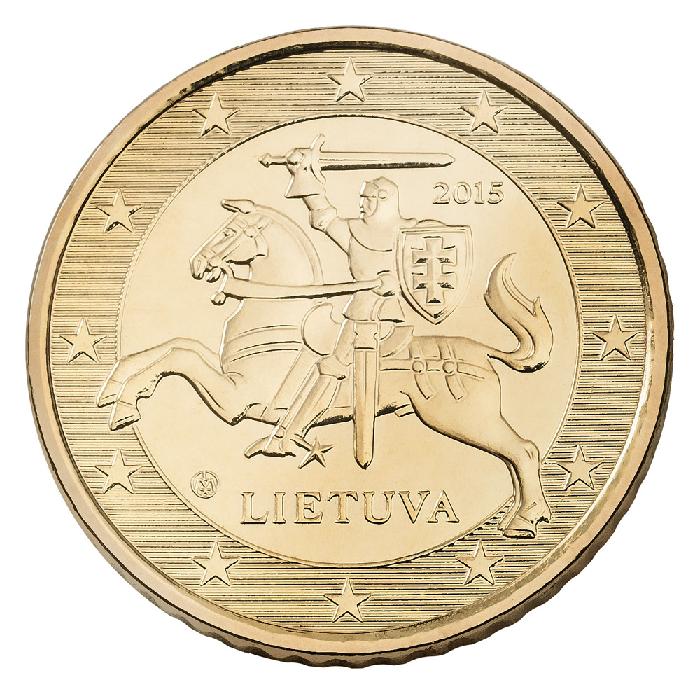
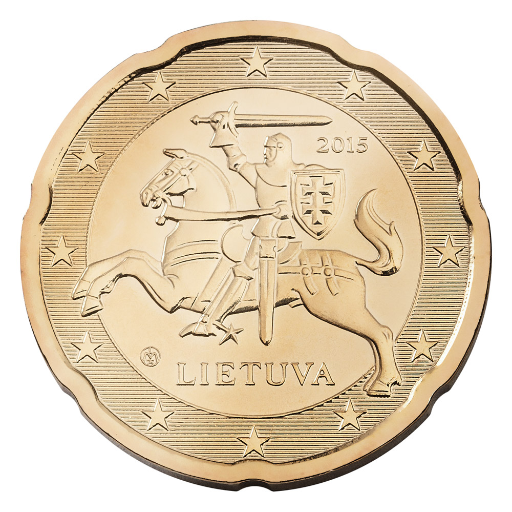
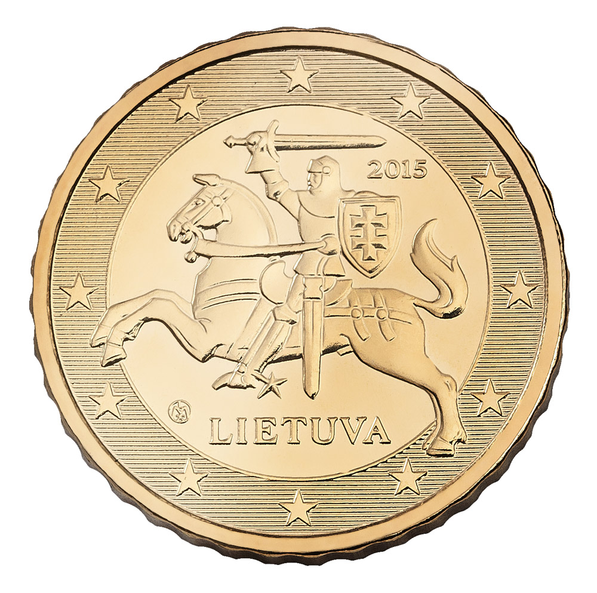
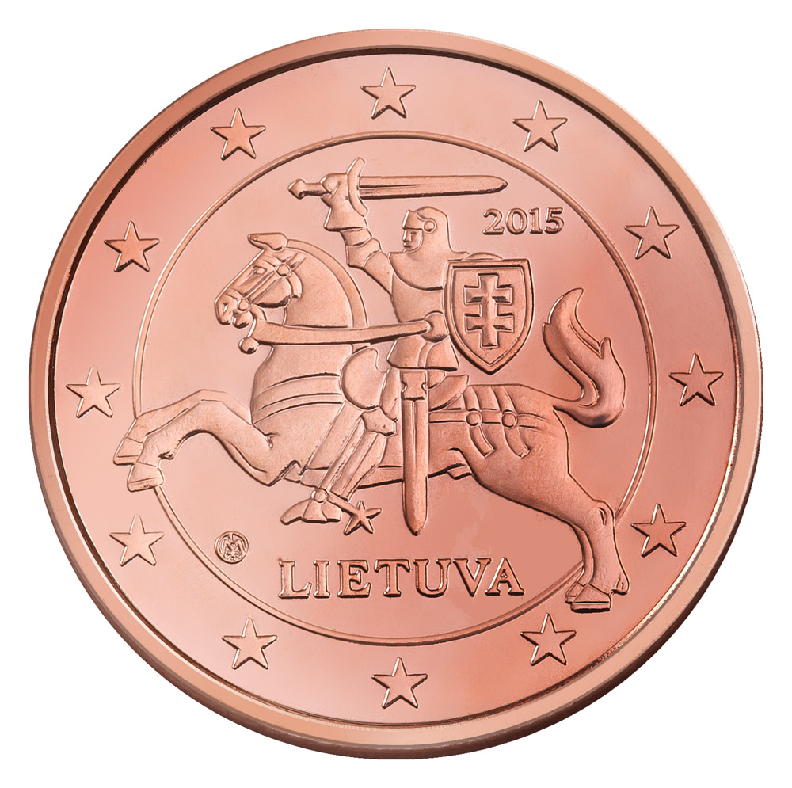
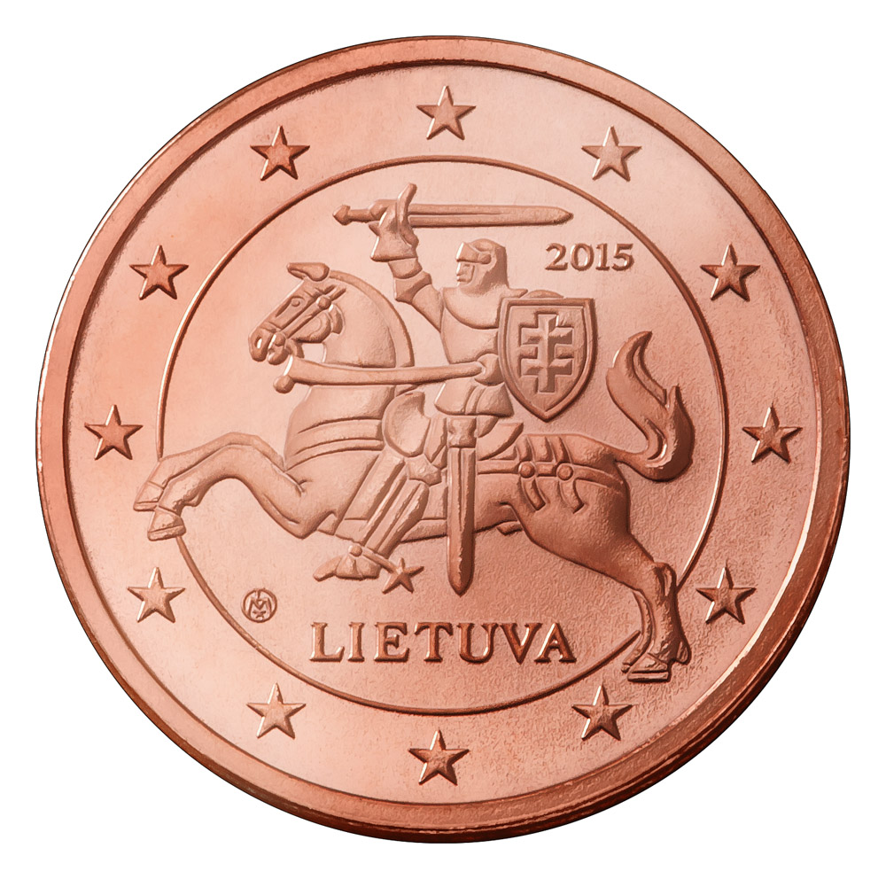
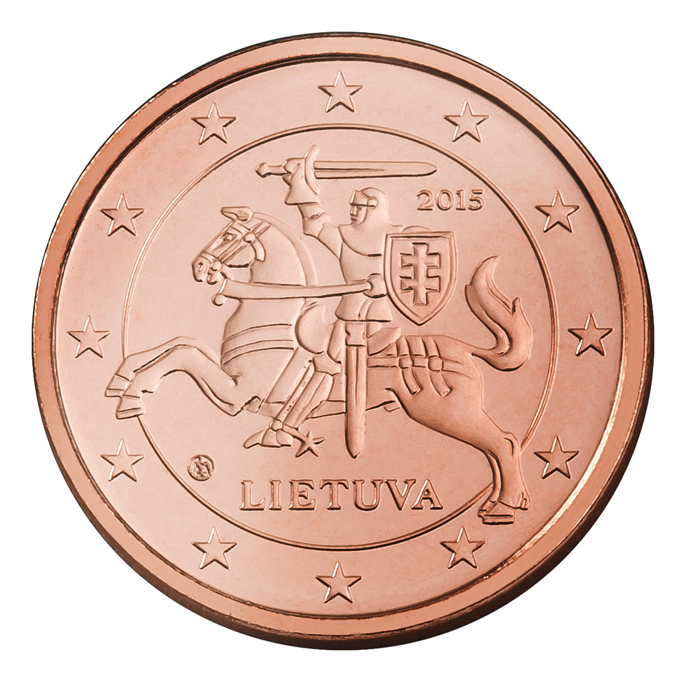

## Coin Set

### Brilliant Uncirculated
 

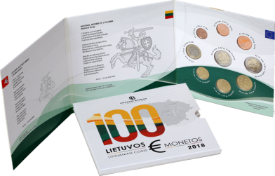

#### 2018 BU Set
Date of Issue: **2018-01-31** 
Mintage: **5,000** 
Mint: **Lithuanian Mint**

 

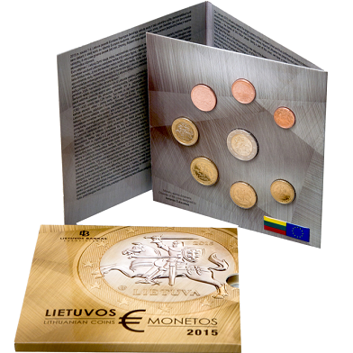

#### 2015 BU Set
Date of Issue: **2015** 
Mintage: **35,000** 
Mint: **Lithuanian Mint**

### Proof
 

#### 2015 Proof Set
Date of Issue: **2015** 
Mintage: **7,000** 
Mint: **Lithuanian Mint**

## Coin Card

## 2 Euro CC
 

#### the Song and Dance Celebration (inscribed on the UNESCO Representative List of the Intangible Cultural Heritage of Humanity) (2018)
Date of Issue: **2018-06-26** 
Mintage: **500,000** 
Mint: **Lithuanian Mint**

 

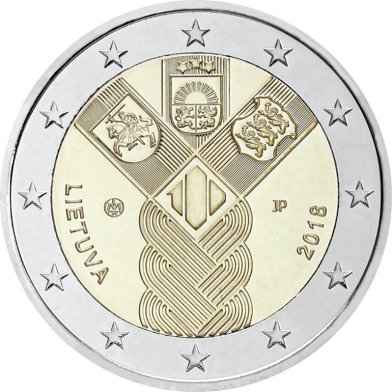

#### the 100th anniversary of the Baltic States (2018)
Date of Issue: **2018-01-31** 
Mintage: **1,000,000** 
Mint: **Lithuanian Mint**

 

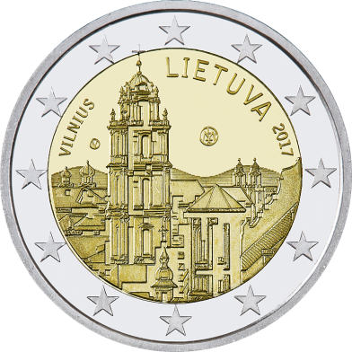

#### Vilnius (2017)
Date of Issue: **2017-08-31** 
Mintage: **1,000,000** 
Mint: **Lithuanian Mint**

 

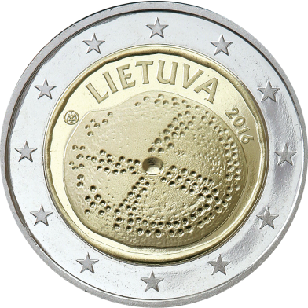

#### Baltic culture (2016)
Date of Issue: **2016** 
Mintage: **1,000,000** 
Mint: **Lithuanian Mint**

 

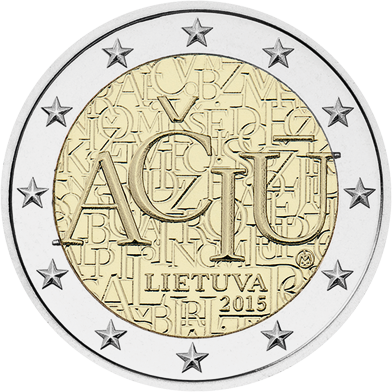

#### the Lithuanian language (2015)
Date of Issue: **2015** 
Mintage: **1,000,000** 
Mint: **Lithuanian Mint**

 

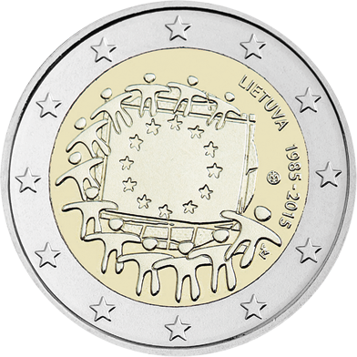

#### celebrate 30 years of the EU flag (2015)
Date of Issue: **2015** 
Mintage: **750,000** 
Mint: **Lithuanian Mint**

