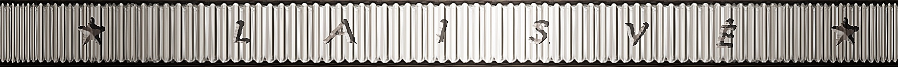
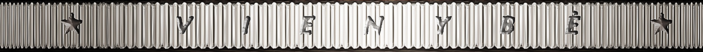
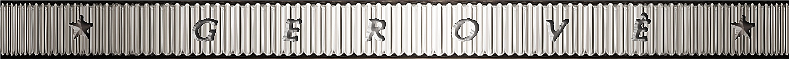

# Lithuania
[Circulation](#circulation)  
[2 Euro CC](#2eurocc)  
[Coin Set](#coinset)
  - [Proof](#proofset)
  - [Brilliant Uncirculated](#buset)

## Circulation

## 2 Euro CC

#### the Song and Dance Celebration (inscribed on the UNESCO Representative List of the Intangible Cultural Heritage of Humanity) (2018)
Date of Issue: **2018-06-26**
Mintage: **500,000**
Mint: **Lithuanian Mint**

#### the 100th anniversary of the Baltic States (2018)
Date of Issue: **2018-01-31**
Mintage: **1,000,000**
Mint: **Lithuanian Mint**

#### Vilnius (2017)
Date of Issue: **2017-08-31**
Mintage: **1,000,000**
Mint: **Lithuanian Mint**

#### Baltic culture (2016)
Date of Issue: **2016**
Mintage: **1,000,000**
Mint: **Lithuanian Mint**

#### the Lithuanian language (2015)
Date of Issue: **2015**
Mintage: **1,000,000**
Mint: **Lithuanian Mint**

#### celebrate 30 years of the EU flag (2015)
Date of Issue: **2015**
Mintage: **750,000**
Mint: **Lithuanian Mint**

## <a name="coinset">Coin Set

### Proof

#### 2015 Proof Set
Date of Issue: **2015**
Mintage: **7,000**
Mint: **Lithuanian Mint**

### Brilliant Uncirculated

#### 2018 BU Set
Date of Issue: **2018-01-31**
Mintage: **5,000**
Mint: **Lithuanian Mint**

#### 2015 BU Set
Date of Issue: **2015**
Mintage: **35,000**
Mint: **Lithuanian Mint**
